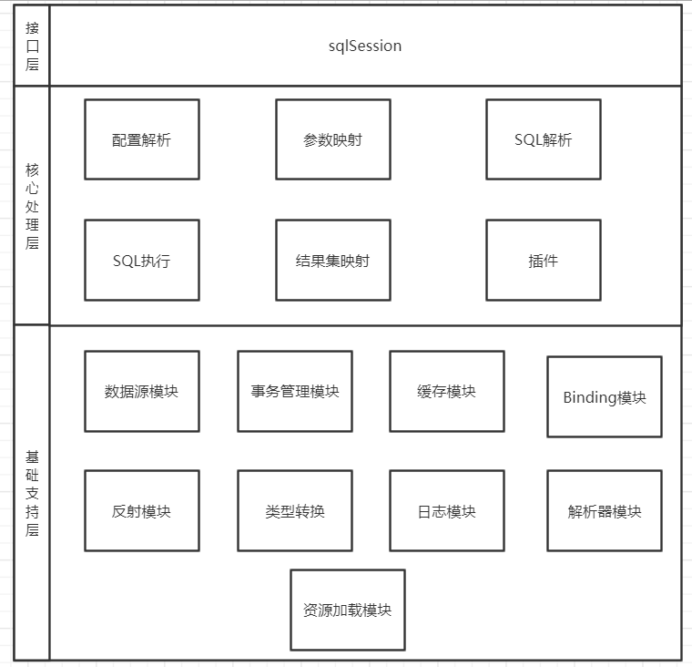

### Mybatis 整体架构  

mybatis 是当前比较流行的orm框架。整体框架分为三层，分别为基础支持层，核心处理层
和接口层。如图所示：

#### 基础支持层   
* 反射模块   
对java原生的反射进行封装，提供更加简洁易用的 API，方便上层调用，并且对
反射操作进行优化，例如缓存类的元数据，提高反射操作的性能。
* 类型转换模块   
提供mybaits配置文件别名机制功以及实现jdbc类型与java类型之间的转换
* 日志模块  
提供日志记录功能以及方便集成第三方日志框架
* 资源加载模块   
对类加载器进行封装，确定类加载器的使用顺序，并提供了加载类文件以及其他资源文件的功能
* 解析器模块   
对xml文件解析类库XPath进行封装，提供解析配置文件以及映射文件的解析功能。处理动态SQL
语句中的占位符。
* 数据源模块  
实现数据源功能，例如连接池功能，检测连接状态等。提供与第三方数据源集成的接口。
* 事务管理   
对数据库中的事务进行抽象，提供相应的事务接口和简单实现以及其他事务管理框架进行集成
* 缓存模块   
提供一级和二级缓存的实现支持
* Binding 模块  
将用户自定义的Mapper接口和映射配置文件关联
#### 核心处理层
* 配置解析
* SOL 解析与 scripting 模块
* SOL 执行
* 插件
#### 接口层